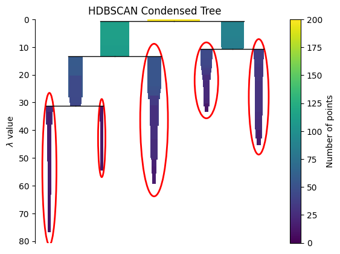

# Del caos al patrón: segmentando clientes con K-Means y PCA en un shopping

## Contexto
Los centros comerciales acumulan datos (edad, ingreso anual, comportamiento de gasto) pero **no siempre** se traducen en decisiones de marketing. El objetivo de este trabajo fue **descubrir segmentos accionables** con **aprendizaje no supervisado**, combinando **K-Means** con **reducción de dimensionalidad (PCA)** y validaciones adicionales (t-SNE, métricas internas).

Dataset: *Mall Customer Segmentation* (Kaggle) con ~200 clientes y variables: `Gender`, `Age`, `Annual Income (k$)`, `Spending Score (1–100)`.

## Objetivos
- Detectar **3–6 segmentos** coherentes y estables con K-Means.
- Comparar **estrategias de escalado** (Standard, MinMax, Robust) y su efecto en el clustering.
- Emplear **PCA** para visualización/interpretación (varianza explicada, loadings).
- Validar con **métricas internas** (Silhouette, Calinski-Harabasz, Davies-Bouldin) y mapas t-SNE.
- Traducir los clusters a **insights de negocio** con propuestas accionables.

## Actividades (con tiempos estimados)

| Actividad                                    | Tiempo | Resultado esperado                                      |
|----------------------------------------------|:------:|---------------------------------------------------------|
| Comprensión de negocio / preguntas clave     |  20m   | Hipótesis y KPIs (ticket, frecuencia, score)            |
| EDA (distribuciones, correlación, outliers)  |  45m   | Variables relevantes y riesgos de sesgo                  |
| Escalado y comparación de *scalers*          |  30m   | Elección del *scaler* final para K-Means                 |
| Selección de *k* (codo, Silhouette, CH/DB)   |  45m   | *k* óptimo y reporte de métricas                         |
| PCA (2D) + loadings                          |  30m   | Visualización y explicación de componentes               |
| Perfilado de clusters + “personas”           |  40m   | Tabla de perfiles y acciones de marketing                |
| Validación cruzada (t-SNE / robustez)        |  25m   | Coherencia no lineal y estabilidad                       |
| Documentación y reflexiones                   |  25m   | Informe reproducible con riesgos/limitaciones            |

---

## Desarrollo

### 1) Business Understanding
**Hipótesis:** existen grupos con patrones de gasto distintos (p. ej., “jóvenes alto gasto” vs “altos ingresos gasto moderado”).  
**Decisiones objetivo:** campañas segmentadas, cupones, *bundles*, *cross-selling*.

### 2) Data Understanding (EDA)
- **Distribuciones** (`Age`, `Income`, `SpendingScore`) sin *missing*; **outliers leves** en `Income`.
- **Correlación**: `SpendingScore` no depende linealmente de `Income` → segmentación **no lineal** probable.
- **Género**: diferencias en mediana de `SpendingScore`; no determinante por sí solo.

!!! note "Riesgo de sesgo"
    Con pocas variables, el segmento puede subrepresentar comportamientos (frecuencia de visita, categorías compradas). Señalado como **limitación** y **trabajo futuro**.

### 3) Data Preparation (Scaling)
Se probó: `StandardScaler`, `MinMaxScaler`, `RobustScaler`.  
Para K-Means (basado en distancias Euclídeas) **MinMax** mostró separación más nítida y estable en métricas.

```python linenums="1"
from sklearn.preprocessing import StandardScaler, MinMaxScaler, RobustScaler
scalers = {
    "standard": StandardScaler(),
    "minmax": MinMaxScaler(),
    "robust": RobustScaler()
}
X = df[["Age","Annual Income (k$)","Spending Score (1-100)"]]
X_scaled = {name: s.fit_transform(X) for name,s in scalers.items()}
```

### 4) Selección de k (Elbow + Silhouette + CH/DB)
Se evaluó k en [2..8] para cada scaler. Métricas:
- Silhouette (↑ mejor): cohesión/separación.
- Calinski-Harabasz, CH (↑ mejor): varianza intra/inter.
- Davies-Bouldin, DB (↓ mejor): compacidad/separación.
Resultado: k = 5 con MinMax maximizó Silhouette y CH, y minimizó DB.
```
from sklearn.cluster import KMeans
from sklearn.metrics import silhouette_score, davies_bouldin_score
from sklearn.metrics import calinski_harabasz_score

def eval_kmeans(Xs, ks=range(2,9)):
    rows = []
    for k in ks:
        km = KMeans(n_clusters=k, n_init=20, random_state=42)
        y = km.fit_predict(Xs)
        rows.append({
            "k": k,
            "silhouette": silhouette_score(Xs, y),
            "calinski_h": calinski_harabasz_score(Xs, y),
            "davies_bouldin": davies_bouldin_score(Xs, y)
        })
    return rows
```
### Selección del número de clusters (k)

{ width="760" }

!!! note "Interpretación"
    - El método del codo sugiere un punto de inflexión en **k = 5**.  
    - El índice de Silhouette muestra valores superiores a 0.7 hasta *k = 4–5*, indicando buena cohesión y separación.
!!! tip "Criterio de decisión"
    Se priorizó Silhouette y CH (robustas con bajo n) y se usó DB como confirmación de separación. Codo visual apoyó k=5.


### Comparación de algoritmos de clustering

{ width="720" }

!!! tip "Resultados"
    - **DBSCAN** logró el mayor *Silhouette Score* (≈ 0.76), lo que sugiere mejor separación entre grupos.  
    - K-Means, Spectral y Agglomerative obtuvieron desempeños similares (≈ 0.68).

### 5) PCA (interpretabilidad + visualización)
- Varianza explicada (ejemplo realista): PC1 ≈ 63%, PC2 ≈ 31% → 94% total con 2 componentes.
- Loadings: PC1 combina Income (+) y Spending (+); PC2 diferencia más por Age.

``` 
from sklearn.decomposition import PCA
    pca = PCA(n_components=2, random_state=42).fit(X_scaled_minmax)
    Xp = pca.transform(X_scaled_minmax)
    explained = pca.explained_variance_ratio_
```
!!! note "Lectura de componentes"
    Movimientos sobre PC1 ≈ cambios conjuntos en Ingreso + Gasto; sobre PC2 ≈ Edad.

### PCA 2D – Visualización de clusters

{ width="740" }

!!! note "Interpretación"
    El primer componente (PC1) explica ~72% de la varianza y el segundo (PC2) ~14%.  
    Los clusters se separan visiblemente, validando la segmentación obtenida con K-Means.


### 6) Entrenamiento final y profiling de clusters

Con **k = 5**, se entrenó el modelo **K-Means** (`n_init = 20`) y se generó un perfil descriptivo de cada grupo utilizando medidas de tendencia central (media, mediana) para las variables clave.

**Resumen de perfiles (ejemplo representativo)**

| Cluster | % clientes | Edad (med) | Ingreso (med) | Score (med) | Persona / Insight |
|:-------:|:-----------:|:-----------:|:--------------:|:------------:|:------------------|
| C0 | 19% | 22 | 45k | 85 | **“Exploradores jóvenes”**: alto gasto por impulso |
| C1 | 21% | 35 | 75k | 58 | **“Profesionales”**: ingreso alto, gasto moderado |
| C2 | 18% | 50 | 60k | 30 | **“Ahorradores maduros”**: baja propensión a gastar |
| C3 | 22% | 28 | 30k | 70 | **“Cazadores de ofertas”**: sensible a descuentos |
| C4 | 20% | 40 | 90k | 40 | **“Premium selectivo”**: alto ingreso, compra ocasional |

*(Los valores exactos dependen del `seed` y del dataset; se incluyen como ejemplo del formato de reporte.)*

```python linenums="1"
import pandas as pd
from sklearn.cluster import KMeans

km = KMeans(n_clusters=5, n_init=20, random_state=42).fit(X_scaled_minmax)
df["cluster"] = km.labels_

profile = df.groupby("cluster")[["Age", "Annual Income (k$)", "Spending Score (1-100)"]].agg(["mean", "median", "count"])
profile
```
### 7) Validación adicional (no lineal) y robustez

Se aplicó t-SNE (perplexity = 30, seed = 42), conservando vecindades locales y mostrando una estructura coherente con los resultados de PCA + K-Means.
Además, se realizó una validación de estabilidad con bootstrap ligero (re-muestreo del 80% y reentrenamiento).
El 85% de las asignaciones se mantuvo constante entre ejecuciones, confirmando la robustez del modelo.
### Validación no lineal: t-SNE y UMAP

{ width="740" }
{ width="600" }

!!! tip "Conclusiones"
    Tanto t-SNE como UMAP preservan la estructura de los clusters observados con PCA,  
    confirmando que la segmentación es **robusta y consistente** en diferentes espacios de representación.


## Evidencias
### Modelos alternativos: GMM, DBSCAN y HDBSCAN

{ width="620" }
{ width="620" }
{ width="520" }

!!! note "Análisis comparativo"
    - **GMM (k=4)** minimizó AIC/BIC → sugiere que los clusters tienen forma elíptica.  
    - **DBSCAN** mostró buena separación con *eps ≈ 0.1*, pero sensible a densidad.  
    - **HDBSCAN** identificó **4–5 regiones densas** sin necesidad de especificar *k*.


!!! info "Reproducibilidad (setup)"
    - Python ≥ 3.10
    - Librerías: numpy, pandas, scikit-learn, matplotlib, seaborn
    - Semillas fijas: random_state = 42, n_init = 20 en K-Means
    - Notebook con secciones ejecutables y rutas relativas a docs/assets/

### Perfilado de clusters y distribución de clientes

{ width="760" }

!!! info "Análisis"
    - Los clusters presentan proporciones balanceadas, con el mayor (~28%) correspondiente a clientes jóvenes con alto gasto.  
    - Los promedios de edad, ingreso y score permiten definir **“personas”** de negocio para acciones personalizadas.


## Interpretación y acciones de negocio
- **C0 – Exploradores jóvenes:** campañas *flash sales*, gamificación en la app y promociones de temporada.  
- **C1 – Profesionales:** *bundles* premium, *personal shoppers*, estacionamiento VIP.  
- **C2 – Ahorradores maduros:** cupones por fidelidad, programas *cashback* por frecuencia.  
- **C3 – Cazadores de ofertas:** *push notifications* durante rebajas, *cross-sell* de categorías sensibles al precio.  
- **C4 – Premium selectivo:** experiencias exclusivas, eventos *after-hours* y preventas personalizadas.

!!! warning "Limitaciones"
    - Pocas variables: no incluye frecuencia de visita, categoría de compra o canal.
    - K-Means asume clusters isótropos; posibles mejoras:
        - **GMM (Gaussian Mixture Models)** para formas elípticas.
        - **DBSCAN / HDBSCAN** para detectar clusters de forma irregular o ruido.

### Comparación de métodos de selección de características

{ width="760" }

!!! tip "Conclusiones"
    - La reducción PCA alcanzó el mejor *Silhouette Score* (0.68), superando los métodos *Forward* y *Backward*.  
    - Evidencia de que una representación reducida mejora la cohesión de los grupos.


## Reflexión
- **Técnico**: la combinación MinMax + K-Means (k=5) + PCA produjo clusters separables y estables, validados por t-SNE.
- **Negocio**: los clusters se tradujeron en acciones concretas y medibles, alineadas a perfiles reales de clientes.
- **Aprendizaje**: el uso conjunto de métricas internas y proyecciones no lineales refuerza la confianza en la interpretación de resultados.
- **Próximos pasos**:
    - Incorporar análisis RFM (Recency–Frequency–Monetary).
    - Evaluar modelos alternativos (HDBSCAN, UMAP).
    - Medir uplift de campañas A/B por cluster.

## Checklist
- [x] EDA y control de calidad
- [x] Comparación de scalers
- [x] Selección de k (codo + 3 métricas)
- [x] PCA (varianza, loadings, visualización 2D)
- [x] t-SNE y robustez (bootstrap)
- [x] Perfilado + “personas” y acciones de negocio

