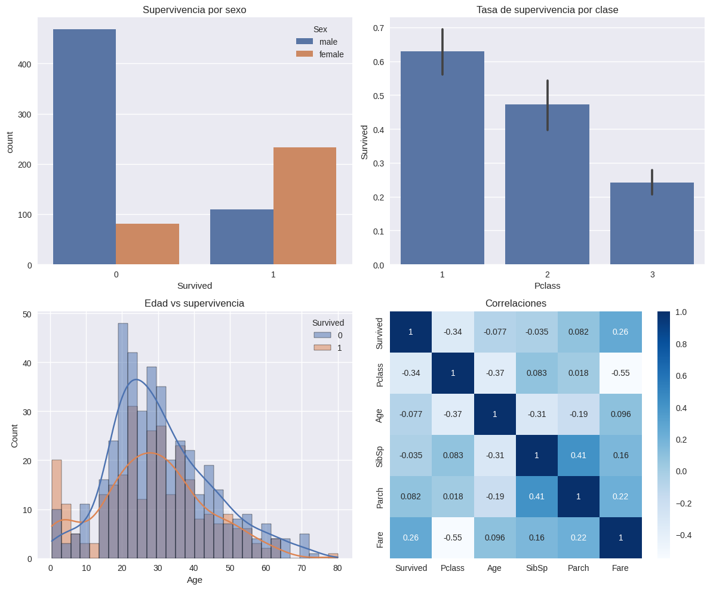

# Análisis Exploratorio y Modelo Base del Titanic

## Contexto
El conjunto de datos del Titanic es un clásico en ciencia de datos y aprendizaje automático. El objetivo es predecir la supervivencia de los pasajeros a partir de atributos como clase, sexo, edad y tarifa. Esta práctica incluyó un **Análisis Exploratorio de Datos (EDA)** y la construcción de un **modelo base**, con el propósito de comprender la estructura del dataset, identificar problemas de calidad de datos y entrenar un modelo de referencia.

## Objetivos
- Realizar un EDA del dataset Titanic, identificando variables relevantes para la predicción de la supervivencia.  
- Detectar problemas de calidad de datos y aplicar estrategias de imputación o eliminación.  
- Implementar un baseline con `DummyClassifier` y compararlo con un modelo de Regresión Logística.  
- Evaluar el desempeño de los modelos con métricas de clasificación.  

## Actividades (con tiempos estimados)

| Actividad                     | Tiempo | Resultado esperado                         |
|--------------------------------|:------:|--------------------------------------------|
| Revisión del dataset y variables | 20m   | Descripción de atributos y variable objetivo |
| Limpieza de datos y valores nulos | 25m   | Estrategias de imputación y eliminación     |
| Formulación de hipótesis y correlaciones | 30m   | Hipótesis sobre sexo, clase y edad         |
| Implementación de modelos base  | 45m   | DummyClassifier y Regresión Logística       |
| Evaluación de resultados        | 20m   | Métricas y matriz de confusión              |

## Desarrollo
En el EDA se identificaron como variables clave: `Pclass`, `Sex`, `Age`, `SibSp`, `Parch`, `Fare` y `Embarked`. La variable objetivo es `Survived` (0 = No sobrevivió, 1 = Sobrevivió).  

Se formularon hipótesis iniciales:  
- Las mujeres y los niños tienen mayor probabilidad de sobrevivir.  
- Los pasajeros de primera clase tienen más probabilidad de sobrevivir  que los de tercera.  
- `Pclass` y `Fare` están correlacionados.  

Respecto a la calidad de los datos:  
- `Cabin` presentó demasiados valores faltantes, por lo que se eliminó.  
- `Age` se imputó utilizando la media.  

Para el modelado, se implementó primero un **DummyClassifier**. Luego, un modelo de **Regresión Logística** utilizando `train_test_split`, con `stratify` para mantener la proporción de clases y `random_state` para garantizar reproducibilidad. Se analizaron parámetros clave como `penalty`, `C`, `solver` y `max_iter`.  

La evaluación se realizó con métricas de clasificación (`accuracy`, `precision`, `recall`, `f1-score`) y la matriz de confusión. Esto permitió comprobar que la regresión logística captaba patrones más significativos que el baseline.  

## Evidencias
- Distribución de edad, clase y sexo en relación a la supervivencia.  
- Tabla de imputación de datos faltantes en `Age`.  
- Gráficos de correlación (`Pclass` vs `Fare`).  
- Reporte de métricas comparando DummyClassifier y Regresión Logística.  

{ width="720" }

!!! note "Nota"
    El baseline con DummyClassifier resultó clave para dimensionar el valor real del modelo entrenado.  

???+ info "Ver pasos del análisis"
    - Paso 1: Investigación del dataset y definición de la variable objetivo  
    - Paso 2: Identificación y tratamiento de valores faltantes  
    - Paso 3: Planteamiento de hipótesis iniciales  
    - Paso 4: Implementación de modelos base  
    - Paso 5: Evaluación de métricas y discusión  

## Reflexión
La práctica reforzó la importancia de un **EDA riguroso** para guiar la construcción de modelos. El uso de un baseline permitió validar que la Regresión Logística aportaba un aprendizaje real frente al azar.  

Aprendí a **formular hipótesis**, verificar correlaciones y valorar la calidad de los datos antes del modelado. Como mejora futura, se recomienda:  
- Desarrollar **ingeniería de características** (ejemplo: variable “familiares a bordo” combinando `SibSp` y `Parch`).  
- Probar modelos más complejos como árboles de decisión y random forests.  

## Checklist

- [x] Identificación de variables relevantes  
- [x] Limpieza y tratamiento de valores faltantes  
- [x] Planteamiento de hipótesis iniciales  
- [x] Implementación de baseline  
- [x] Evaluación de un modelo supervisado  

## Referencias
- Kaggle Titanic Dataset: [https://www.kaggle.com/c/titanic](https://www.kaggle.com/c/titanic)  
- Documentación de scikit-learn: [https://scikit-learn.org](https://scikit-learn.org)  
- Apuntes de clase sobre EDA y clasificación supervisada.  
