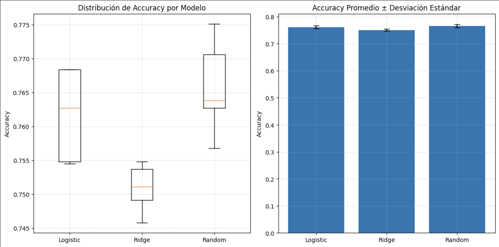
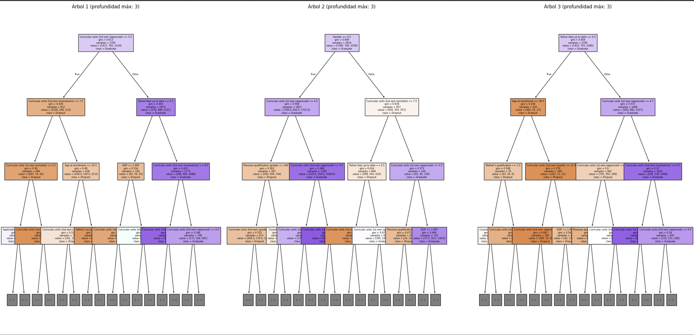

# Validación y Selección de Modelos

## Contexto
En problemas de clasificación supervisada no basta con entrenar un modelo: es necesario **validar su rendimiento**, seleccionar el mejor entre varias alternativas y optimizar sus hiperparámetros. Esta práctica se centró en un dataset educativo (4424 muestras, 36 variables académicas, demográficas y socioeconómicas) con el objetivo de predecir el estado académico final de los estudiantes: *Dropout, Enrolled, Graduate*.  

## Objetivos
- Comprender la importancia de la validación cruzada en datasets desbalanceados.  
- Comparar múltiples modelos de clasificación y evaluar su estabilidad.  
- Aplicar técnicas de optimización de hiperparámetros (GridSearchCV y RandomizedSearchCV).  
- Reflexionar sobre riesgos como el *data leakage* y la necesidad de explicabilidad.  

## Actividades (con tiempos estimados)

| Actividad                          | Tiempo | Resultado esperado                          |
|------------------------------------|:------:|---------------------------------------------|
| Análisis inicial del dataset        | 25m    | Identificación de variables y clases         |
| Implementación de validación cruzada | 40m   | Resultados promedio y desviación estándar    |
| Comparación de modelos              | 30m    | Ranking de rendimiento y estabilidad         |
| Optimización de hiperparámetros     | 30m    | Selección de configuraciones óptimas         |
| Reflexión sobre explicabilidad      | 20m    | Conclusiones sobre confianza y sesgos        |

## Desarrollo
El análisis comenzó con la descripción del dataset, identificando clases desbalanceadas. Se aplicó **validación cruzada (Cross-Validation)** con `StratifiedKFold` para mantener la proporción de clases en cada fold. Se reportaron resultados en formato `accuracy promedio ± desviación estándar`, lo que permitió evaluar no solo el rendimiento medio sino también la **estabilidad** de cada modelo.  

Se realizó un “torneo” de modelos, seleccionando el mejor balance entre rendimiento y consistencia. Posteriormente, se aplicaron técnicas de optimización de hiperparámetros:  
- **GridSearchCV** para espacios de búsqueda reducidos.  
- **RandomizedSearchCV** para espacios grandes o limitaciones de tiempo.  

Además, se resaltó la importancia de la **explicabilidad del modelo** en contextos educativos:  
- Generar confianza en los docentes.  
- Permitir intervenciones basadas en las características importantes.  
- Detectar sesgos y cumplir con regulaciones.  

Finalmente, se reflexionó sobre riesgos como el **data leakage** (información indebida en entrenamiento), la elección entre KFold y StratifiedKFold, y la preferencia por modelos **estables** aunque no maximicen la exactitud.  

## Evidencias
- Estadísticas del dataset (4424 muestras, 36 variables).  
- Validación cruzada con `StratifiedKFold` mostrando promedio y desviación estándar.  
- Comparación de rendimiento entre diferentes modelos de clasificación.  
- Ejemplo de GridSearchCV vs RandomizedSearchCV.  
- Reflexiones sobre explicabilidad y decisiones prácticas en modelos educativos.  


```python linenums="1"
from sklearn.model_selection import StratifiedKFold, cross_val_score, GridSearchCV
from sklearn.ensemble import RandomForestClassifier

# Validación cruzada
cv = StratifiedKFold(n_splits=5, shuffle=True, random_state=42)
rf = RandomForestClassifier(random_state=42)
scores = cross_val_score(rf, X, y, cv=cv, scoring="accuracy")
print(f"Accuracy: {scores.mean():.2%} ± {scores.std():.2%}")

# Optimización de hiperparámetros
param_grid = {"n_estimators": [100, 200], "max_depth": [None, 10, 20]}
grid = GridSearchCV(rf, param_grid, cv=cv, scoring="accuracy")
grid.fit(X, y)
print("Mejor configuración:", grid.best_params_)
```

## Visualizaciones
{ width="720" }

{ width="720" }

!!! tip "Sugerencia"
    Para problemas desbalanceados es recomendable usar **StratifiedKFold** para asegurar la representación de todas las clases en cada fold.  

???+ info "Preguntas clave"
    - ¿Qué significa un resultado `95.2% ± 2.1%`? → Promedio de exactitud y variabilidad.  
    - ¿Por qué Random Forest no necesita `StandardScaler`? → Sus divisiones se basan en umbrales, no en magnitudes.  
    - ¿Qué es más importante en diagnóstico médico: exactitud máxima o estabilidad? → La estabilidad, por la confiabilidad de las predicciones.  

## Reflexión
La práctica permitió comprender que un buen modelo no solo es aquel con mayor exactitud, sino también el que **mantiene un rendimiento estable** en diferentes particiones. Además, se reforzó la idea de que la explicabilidad no es un extra, sino una necesidad en contextos educativos y sociales.  

Aprendí a valorar tanto el rendimiento como la consistencia y a seleccionar técnicas de optimización adecuadas según los recursos. Como trabajo futuro, se podrían probar enfoques de **AutoML** y técnicas de **feature importance** para profundizar en la interpretabilidad.  

## Checklist
- [x] Análisis inicial del dataset  
- [x] Validación cruzada con StratifiedKFold  
- [x] Comparación de modelos  
- [x] Optimización de hiperparámetros  
- [x] Reflexión sobre explicabilidad  

## Referencias
- Documentación scikit-learn: [https://scikit-learn.org](https://scikit-learn.org)  
- Apuntes de clase sobre validación cruzada y selección de modelos.  
- Lecturas complementarias sobre GridSearchCV, RandomizedSearchCV y explicabilidad.  
