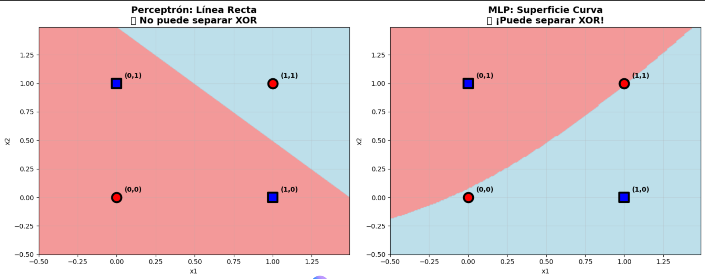
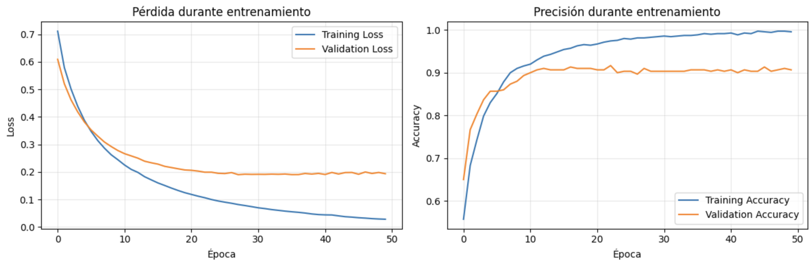
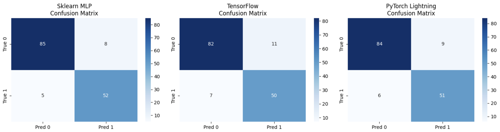

# Del perceptrón al aprendizaje profundo: cómo las redes neuronales aprendieron a resolver XOR

## Contexto
En esta práctica se exploró la evolución de los modelos de aprendizaje supervisado desde el **perceptrón simple** hasta las **redes neuronales multicapa (MLP)**, analizando tanto sus fundamentos teóricos como su implementación práctica en distintos frameworks: *scikit-learn*, *TensorFlow* y *PyTorch Lightning*.  

El objetivo fue comprender cómo el aumento de capas y funciones de activación permite resolver problemas no linealmente separables (como XOR) y cómo los frameworks modernos ofrecen distintos niveles de control, automatización y flexibilidad.

## Objetivos
- Implementar y analizar el comportamiento del perceptrón simple (AND, OR, NOT, XOR).  
- Entrenar una red neuronal multicapa (MLP) para resolver XOR.  
- Comparar implementaciones en *scikit-learn*, *TensorFlow* y *PyTorch Lightning*.  
- Analizar funciones de activación, pérdida, batch size, epochs y convergencia.  
- Reflexionar sobre buenas prácticas, reproducibilidad y elección de frameworks según contexto.

## Actividades (con tiempos estimados)

| Actividad                             | Tiempo | Resultado esperado                                   |
|--------------------------------------|:------:|------------------------------------------------------|
| Implementación del perceptrón (AND, OR, NOT) | 30m   | Red neuronal lineal que resuelve operaciones simples |
| Exploración del caso XOR             | 30m   | Demostración de no linealidad y necesidad de MLP     |
| Entrenamiento de MLP con sklearn     | 40m   | Modelo funcional que resuelve XOR correctamente      |
| Red neuronal en TensorFlow/Keras     | 45m   | Implementación controlada con funciones de activación|
| Experimentos con PyTorch Lightning   | 45m   | Entrenamiento modular, reproducible y limpio         |
| Reflexión y conexión entre frameworks| 30m   | Comparación técnica y conceptual                     |

---

## Desarrollo

### Parte 1: Perceptrón simple (AND, OR, NOT, XOR)
- Los modelos **AND**, **OR** y **NOT** fueron correctamente resueltos, al ser **linealmente separables**.  
- El modelo **XOR** no fue posible con un solo perceptrón, confirmando su **no linealidad**.  
- Se introdujo el concepto de **frontera de decisión lineal** y su limitación en el plano 2D.

#### Frontera de decisión: Perceptrón vs MLP

{ width="700" }

!!! note "Interpretación"
    A la izquierda, el perceptrón simple traza una frontera lineal incapaz de separar XOR.  
    A la derecha, el MLP crea una frontera **no lineal (curva)** que combina múltiples neuronas, resolviendo el problema.

---

### Parte 2: MLP con *scikit-learn*
- Se entrenó un **MLPClassifier** con una capa oculta y función de activación *ReLU*.  
- Se verificó que el modelo logra separar correctamente el patrón XOR.  
- Se discutió la diferencia entre una red simple (una capa oculta) y una red profunda (múltiples capas).

```python linenums="1"
from sklearn.neural_network import MLPClassifier
import numpy as np

X = np.array([[0,0],[0,1],[1,0],[1,1]])
y = np.array([0,1,1,0])

mlp = MLPClassifier(hidden_layer_sizes=(2,), activation='relu', max_iter=5000, random_state=42)
mlp.fit(X, y)
print("Predicciones:", mlp.predict(X))
```


**Parte 3: TensorFlow y PyTorch Lightning**  
- En TensorFlow/Keras se construyó una red neuronal desde cero, configurando:
  - Capas ocultas, optimizador, epochs y batch size.  
  - Curvas de *loss* y *val_loss* para detectar overfitting.  
- En PyTorch Lightning se implementó el mismo modelo de manera **modular y reproducible**, utilizando parámetros como `deterministic=True` para garantizar consistencia.  

## Curvas de entrenamiento en TensorFlow
 {width="720"}

!!! note "Analisis"
    Las curvas de entrenamiento muestran que:
    - La pérdida de entrenamiento (**Training Loss**) disminuye progresivamente, señal de aprendizaje.
    - La pérdida de validación (**Validation Loss**) se estabiliza, indicando que el modelo generaliza bien.
    - La precisión de entrenamiento y validación convergen sobre el 90%, sin señales de sobreajuste.

- En **PyTorch Lightning**, se implementó el mismo modelo de forma modular y reproducible, utilizando `deterministic=True` para asegurar resultados consistentes y separando las fases de entrenamiento y evaluación con `training_step` y `test_step`.  

### Comparación de Matrices de Confusión entre Frameworks

{ width="780" }

!!! tip "Interpretación"
    Las tres implementaciones presentan resultados equivalentes con ligeras variaciones:
    - La **diagonal principal** (valores en azul oscuro) representa las predicciones correctas.  
    - Las diferencias mínimas entre frameworks se deben a la inicialización aleatoria y al optimizador utilizado.  
    - Todos los modelos logran una **alta precisión y consistencia**, validando la efectividad del enfoque multicapa.

**Comparación de frameworks:**  

| Escenario | Framework ideal | Justificación |
|------------|----------------|----------------|
| ⚡ Prototipo rápido | `sklearn MLP` | Entrenamiento automático y simple |
| 🏭 Producción | `TensorFlow / Keras` | Control de arquitectura, GPU y despliegue |
| 🔬 Investigación | `PyTorch Lightning` | Flexibilidad y limpieza de código |

### Reflexión
Esta práctica permitió comprender cómo una simple modificación en la arquitectura (añadir una capa oculta) cambia la capacidad de representación del modelo.
También reforzó la diferencia entre frameworks:

- scikit-learn como herramienta rápida de prototipado.

- TensorFlow para control avanzado.

- PyTorch Lightning para investigación reproducible.

Aprendí que la elección del framework depende del propósito: velocidad, control o escalabilidad.
La práctica integró conceptos de unidades previas y consolidó una visión completa del flujo de aprendizaje automático.


## Checklist
- [x] Implementación de perceptrón simple 
- [x] Análisis de XOR y necesidad de no linealidad
- [x] MLP con sklearn y visualización de resultados  
- [x] Red neuronal con TensorFlow
- [x] Entrenamiento modular con PyTorch Lightning
- [x] Comparación de frameworks
- [x] Reflexión integradora entre unidades
