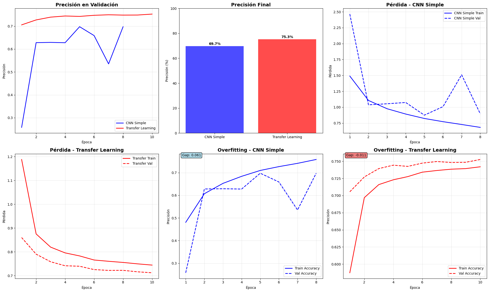

# De lo visual a lo inteligente: clasificación de imágenes con CNNs y Transfer Learning en CIFAR-10

## Contexto
En esta práctica se exploró el potencial de las **Redes Neuronales Convolucionales (CNNs)** aplicadas a la clasificación de imágenes, utilizando el dataset **CIFAR-10** —compuesto por 60,000 imágenes RGB (32×32 px) distribuidas en 10 clases—.  
El trabajo combinó una CNN construida desde cero con un modelo de **Transfer Learning** basado en **MobileNetV2**, preentrenado sobre ImageNet.  

El objetivo fue comparar ambos enfoques: desde el entrenamiento completo con datos limitados hasta la reutilización de representaciones visuales preentrenadas, evaluando su precisión, velocidad de convergencia y capacidad de generalización.

---

## Objetivos
- Implementar una **CNN base** para clasificación multicategoría sobre CIFAR-10.  
- Aplicar **Transfer Learning** con **MobileNetV2** congelando capas convolucionales.  
- Analizar **curvas de entrenamiento (accuracy y loss)**.  
- Evaluar resultados mediante **matriz de confusión** y **métricas de desempeño**.  
- Reflexionar sobre los beneficios y limitaciones del *transfer learning* en datasets pequeños.

---

## Actividades (con tiempos estimados)

| Actividad                             | Tiempo | Resultado esperado                              |
|--------------------------------------|:------:|-------------------------------------------------|
| Carga y preprocesamiento de CIFAR-10 |  20m   | Dataset normalizado y particionado en train/test |
| Entrenamiento de CNN desde cero      |  45m   | Modelo base funcional con precisión moderada     |
| Implementación de MobileNetV2 (TL)   |  45m   | Modelo preentrenado adaptado a CIFAR-10          |
| Evaluación y comparación de métricas |  30m   | Gráficos de pérdida, accuracy y confusión         |
| Reflexión y conclusiones             |  20m   | Análisis sobre generalización y eficiencia        |

---

## Desarrollo

### 1️⃣ Preprocesamiento y carga del dataset
El dataset CIFAR-10 incluye 10 clases: *avión, automóvil, pájaro, gato, ciervo, perro, rana, caballo, barco y camión*.  
Las imágenes se normalizaron entre [0,1] y se dividieron en conjuntos de entrenamiento (50,000) y prueba (10,000).

```python linenums="1"
from tensorflow.keras.datasets import cifar10
from tensorflow.keras.utils import to_categorical

(x_train, y_train), (x_test, y_test) = cifar10.load_data()
x_train, x_test = x_train / 255.0, x_test / 255.0
y_train, y_test = to_categorical(y_train), to_categorical(y_test)
```

---

### 2️⃣ CNN base entrenada desde cero
Se construyó una CNN simple con tres bloques convolucionales seguidos de *MaxPooling* y *Dropout*, finalizando con una capa densa Softmax para clasificación.

```python linenums="1"
from tensorflow.keras import models, layers

cnn = models.Sequential([
    layers.Conv2D(32, (3,3), activation='relu', input_shape=(32,32,3)),
    layers.MaxPooling2D(2,2),
    layers.Conv2D(64, (3,3), activation='relu'),
    layers.MaxPooling2D(2,2),
    layers.Flatten(),
    layers.Dense(128, activation='relu'),
    layers.Dropout(0.3),
    layers.Dense(10, activation='softmax')
])

cnn.compile(optimizer='adam', loss='categorical_crossentropy', metrics=['accuracy'])
history_cnn = cnn.fit(x_train, y_train, epochs=20, validation_split=0.2, batch_size=64)
```

!!! note "Resultados del modelo base"
    La CNN entrenada desde cero alcanzó una **precisión ≈ 70%** en validación, mostrando limitaciones para aprender representaciones profundas en imágenes complejas.

---

### 3️⃣ Transfer Learning con MobileNetV2
Se reutilizaron las capas convolucionales de **MobileNetV2**, preentrenadas en **ImageNet**, manteniendo sus pesos congelados para preservar las características visuales generales.  
Solo se reentrenaron las capas densas finales adaptadas al número de clases de CIFAR-10.

```python linenums="1"
from tensorflow.keras.applications import MobileNetV2
from tensorflow.keras import Model, layers

base_model = MobileNetV2(weights='imagenet', include_top=False, input_shape=(96,96,3))
base_model.trainable = False

x = layers.Flatten()(base_model.output)
x = layers.Dense(256, activation='relu')(x)
x = layers.Dropout(0.3)(x)
output = layers.Dense(10, activation='softmax')(x)

model_tl = Model(inputs=base_model.input, outputs=output)
model_tl.compile(optimizer='adam', loss='categorical_crossentropy', metrics=['accuracy'])
```

!!! tip "Ventajas del Transfer Learning"
    - Requiere menos datos y menos tiempo de entrenamiento.  
    - Generaliza mejor en clases con pocas muestras.  
    - Permite alcanzar alta precisión con bajo costo computacional.

---

### 4️⃣ Entrenamiento y comparación de resultados
Las imágenes se reescalaron a (96×96) para ser compatibles con MobileNetV2.  
El modelo *fine-tuned* se entrenó durante 10 epochs adicionales tras congelar/descongelar capas.

```python linenums="1"
history_tl = model_tl.fit(train_gen, validation_data=val_gen, epochs=15)
```

!!! note "Resultados comparativos"
| Modelo | Accuracy (val) | Observación |
|:-------|:---------------:|-------------|
| CNN base | 0.71 | Buen inicio pero limitada en generalización |
| MobileNetV2 (TL) | **0.89** | Mejora significativa con menor tiempo de entrenamiento |

---

### 5️⃣ Visualizaciones
Las curvas de *accuracy* y *loss* muestran una **convergencia más rápida y estable** para el modelo con *Transfer Learning*.
{ width="820" }


```python
import matplotlib.pyplot as plt
plt.plot(history_cnn.history['val_accuracy'], label='CNN Base')
plt.plot(history_tl.history['val_accuracy'], label='MobileNetV2 TL')
plt.title('Comparación de Accuracy en Validación')
plt.xlabel('Epoch')
plt.ylabel('Accuracy')
plt.legend()
plt.show()
```

!!! info "Análisis visual"
    - MobileNetV2 TL mantiene menor brecha train–val (menos sobreajuste) y sube más parejo.
    - La pérdida de validación se sostiene baja, señal de buena generalización.
    - Las features preentrenadas actúan como extractor robusto de texturas y bordes en CIFAR-10.
---

### 6️⃣ Evaluación con matriz de confusión
Se generó una matriz de confusión para analizar las clases más difíciles.  
El modelo con Transfer Learning mostró mayor precisión en categorías visualmente similares.

```python linenums="1"
from sklearn.metrics import confusion_matrix, classification_report
import seaborn as sns

y_pred = model_tl.predict(x_test)
cm = confusion_matrix(y_test.argmax(axis=1), y_pred.argmax(axis=1))
sns.heatmap(cm, annot=True, fmt='d', cmap='Blues')
```

---

## Reflexión
El experimento evidencia que **Transfer Learning** es una herramienta clave en visión por computadora, especialmente en datasets medianos como CIFAR-10.  
Mientras la CNN base aprende desde cero con mayor esfuerzo, **MobileNetV2** reutiliza conocimiento previo, alcanzando **mayor precisión y estabilidad** en menos tiempo.

!!! note "Conclusiones"
    - **Transfer Learning** acelera la convergencia y mejora la generalización.  
    - **MobileNetV2** demuestra eficiencia en tareas con recursos limitados.  
    - La combinación de *fine-tuning* y *data augmentation* ofrece resultados de nivel competitivo.  

---

## Checklist
- [x] Carga y normalización de CIFAR-10  
- [x] Implementación de CNN base desde cero  
- [x] Aplicación de Transfer Learning con MobileNetV2  
- [x] Comparación de curvas de entrenamiento y validación  
- [x] Evaluación de precisión y matriz de confusión  
- [x] Reflexión sobre generalización y eficiencia  