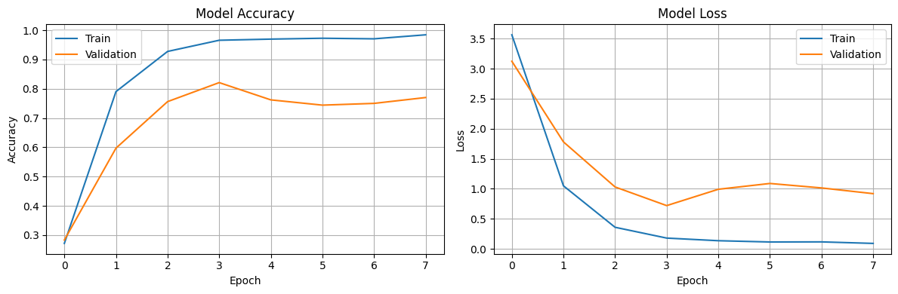
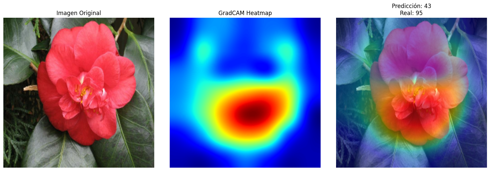
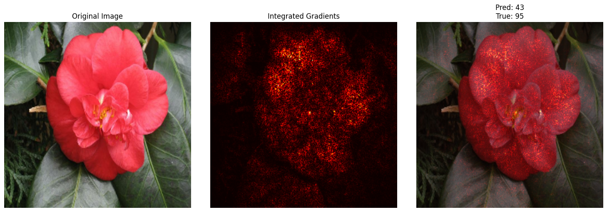

# Aumentar para generalizar: Data Augmentation avanzado y explicabilidad con GradCAM

## Contexto
Esta práctica explora cómo el **Data Augmentation avanzado** mejora la **generalización** en clasificación de imágenes y cómo **GradCAM** aporta **explicabilidad** sobre qué regiones activan al modelo. Se trabaja con un pipeline **baseline** (sin augmentations avanzados) y un pipeline **extendido** (rotaciones, recortes, color jitter, cutout/mixup si corresponde), analizando impacto en **métricas**, **curvas de entrenamiento** y **mapas de calor** GradCAM.

## Objetivos
- Comparar un **pipeline baseline** vs. **augmentation avanzado** y medir su impacto en *accuracy* y *loss*.
- Visualizar **muestras augmentadas** para verificar plausibilidad (no distorsionar la etiqueta).
- Aplicar **GradCAM** sobre aciertos/errores y evaluar si el modelo mira regiones semánticamente relevantes.
- Responder preguntas de **interpretabilidad**, **riesgos de uso** y **posibles mejoras**.

---

## Desarrollo

### 1️⃣ Pipeline baseline vs. avanzado
- **Baseline:** normalización + resize + (opcional) flip horizontal.
- **Avanzado (ejemplo):** `RandomResizedCrop`, `RandomHorizontalFlip`, `ColorJitter`, `RandomRotation`, `RandomErasing` _(o Cutout)_.  
  Si el dataset lo permite, **Mixup/CutMix** para robustez adicional.

!!! warning "Criterio de validez de augmentations"
    Las transformaciones deben **preservar la etiqueta** y no introducir evidencias fuera de distribución (e.g., rotaciones de 90° podrían no ser válidas para dígitos, sí para flores).

### 2️⃣ Entrenamiento y métricas
Entrenamiento comparable (mismas *epochs*, *optimizer*, *lr scheduler*). Guardar **curvas train/val** y **métricas finales**.

**Curvas de entrenamiento y validación:**  
{ width="800" }

!!! note "Lectura de curvas"
    - El **augmentation** suele **elevar la val_accuracy** y **suavizar** la val_loss, especialmente cuando el dataset es limitado.  
    - Si *train accuracy* baja levemente y *val accuracy* sube: **mejor generalización** (regularización por augmentations).

### 3️⃣ Verificación visual de augmentations
**Mosaico de ejemplos augmentados:**  
{ width="780" }

!!! tip "Chequeos rápidos"
    - ¿Se ve **variación útil** (posiciones, iluminación) sin destruir la clase?  
    - ¿Hay artefactos que puedan inducir atajos espurios?

### 4️⃣ GradCAM: aciertos y errores

**Aciertos (GradCAM sobre predicciones correctas):**  
{ width="780" }

**Errores (GradCAM sobre predicciones fallidas):**  
{ width="780" }

!!! note "Qué esperamos ver"
    En aciertos, GradCAM debería resaltar **partes diagnósticas** del objeto. En errores, mapas difusos o zonas **no diagnósticas** son pistas de **atajos** o **confusiones de clase**.

---

## Reflexión
El **augmentation** actuó como **regularizador** efectivo, mejorando la **generalización** y reduciendo la brecha *train–val*. **GradCAM** mostró que, aunque el modelo aprende rasgos semánticos, también puede **apoyarse en contextos**; esto justifica augmentations más **dirigidas** y **validaciones explicables** como parte del ciclo de mejora.

## Checklist
- [x] Pipeline baseline y avanzado  
- [x] Visualización de augmentations  
- [x] Entrenamiento y comparación de métricas  
- [x] GradCAM en aciertos y errores  
- [x] Reflexión y próximos pasos