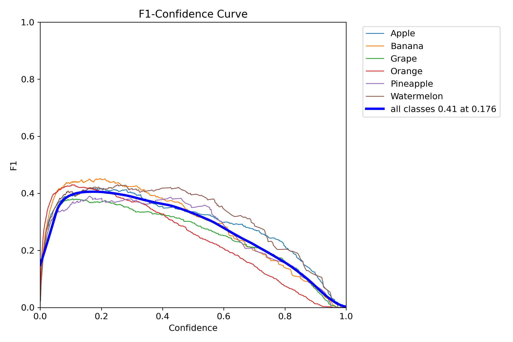
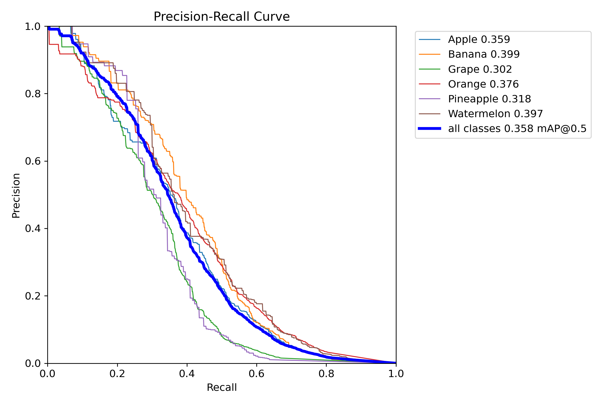
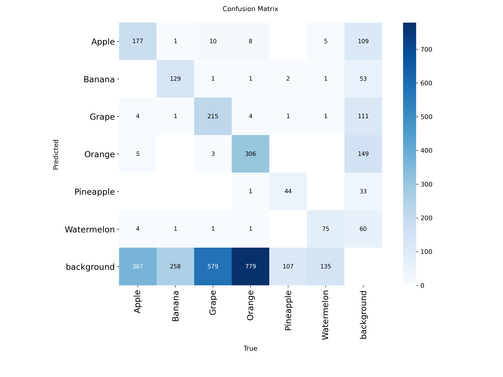
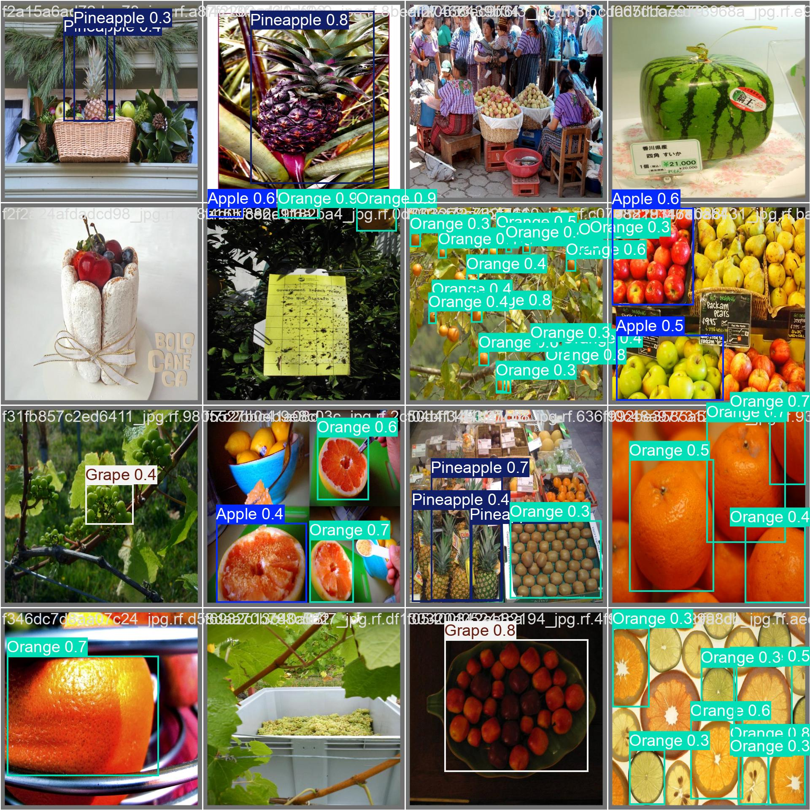
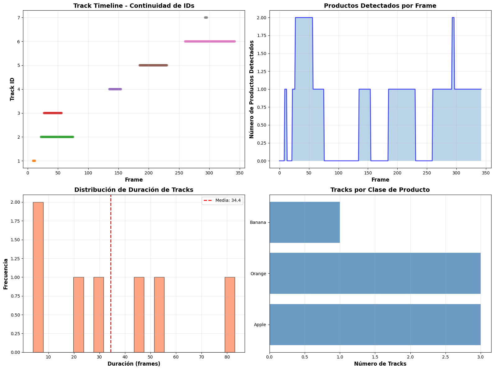

# De la detección al seguimiento: YOLOv8 fine-tuning + tracking en frutas

## Contexto
Se afinó (fine-tuning) **YOLOv8** sobre un dataset de frutas (clases: *apple, banana, grape, orange, pineapple, watermelon* + *background*) y se añadió **tracking** para seguir objetos entre frames.  
Se compararon **métricas de validación** de Ultralytics con **analíticas de tracking** (duración, continuidad de IDs, distribución por clase).

---

## Objetivos
- Ajustar YOLOv8 a un dominio acotado de frutas y evaluar **precisión/recobrado**.
- Seleccionar **umbral de confianza** óptimo a partir de la curva F1-Confidence.
- Medir el desempeño del **seguimiento** (duración, continuidad, tracks por clase).
- Producir **visualizaciones** y **videos** de predicciones y tracking.

---

## Actividades (tiempos estimados)

| Actividad                                     | Tiempo | Resultado esperado                                  |
|-----------------------------------------------|:------:|-----------------------------------------------------|
| Limpieza/estructura del dataset               |  30m   | `train/val/test` con anotaciones YOLO               |
| Fine-tuning de YOLOv8 (3 corridas)            |  60m   | Pesos finos `fruit_finetuned[1..3]`                 |
| Validación y selección de umbral              |  20m   | Umbral óptimo por F1-Confidence                     |
| Tracking con ByteTrack/OCSORT                 |  25m   | IDs consistentes por objeto                         |
| Análisis de métricas y visualizaciones        |  30m   | Curvas PR/F1, matriz de confusión, ejemplos, videos |

---

## Desarrollo

### 1) Entrenamiento y validación (Ultralytics)
Se ejecutó el fine-tuning con **YOLOv8n/s** (según recursos), *batch* acorde a VRAM y *imgsz* fijo.

```bash
yolo detect train data=fruits.yaml model=yolov8n.pt epochs=50 imgsz=640 project=runs/detect name=fruit_finetuned
yolo detect val   data=fruits.yaml model=runs/detect/fruit_finetuned/weights/best.pt
```

**Curvas y diagnóstico**  

- **Curva F1-Confidence** (umbral óptimo ≈ **0.176**, F1≈**0.41**):  
  { width="720" }

- **Curva Precision-Recall** (mAP@0.5 ≈ **0.358** promedio, por clase en leyenda):  
  { width="720" }

- **Matriz de confusión** (validación):  
  { width="760" }

- **Lote de validación (predicciones)**:  
  { width="760" }

**Lectura rápida**
    - Las clases **banana/orange** dominan el rendimiento (PR y F1 más altos).  
    - **background** concentra varios *falsos positivos/negativos* (ver matriz), típico cuando el fondo es muy diverso.  
    - Con el umbral ~0.18 se maximiza F1; para **menos FP** en producción, subir a 0.25–0.30.

---

### 2) Tracking y analíticas
Se aplicó tracking cuadro a cuadro sobre videos de góndola y feria.

```bash
yolo track model=runs/detect/fruit_finetuned/weights/best.pt source=video.mp4 save=True tracker=bytetrack.yaml
```

**Resumen de tracking:**
```
Total productos trackeados: 7
Duración promedio: 34.4 frames (1.1s)
Duración máxima: 83 frames (2.8s) | mínima: 4 frames (0.1s)
Por clase: Apple=3, Orange=3, Banana=1
Tracks cortos (<1s): 3 (42.9%), largos (>3s): 0
```

**Gráficas de continuidad y distribución**  
(IDs por tiempo, productos por frame, histograma de duraciones, tracks por clase)

{ width="900" }


**Visualizaciones en video**
- [Fruits tracking (demo 1)](../assets/03-11-fruits_tracking.mp4)  
- [Grocery tracking (demo 2)](../assets/03-11-grocery_tracked.mp4)


---

## Resultados clave

- **Detección**: mAP@0.5 ≈ **0.358**; F1 máximo ≈ **0.41** a conf≈**0.176**.  
- **Clases fuertes**: *banana*, *orange*.  
- **Principales errores**: *background* y confusiones *grape ↔︎ background* con instancias pequeñas.  
- **Tracking**: media **1.1s** por track; 43% son cortos (<1s), sensibles a oclusión y *blur*.

---

!!! Recomendaciones
    - Aumentar *augmentations* de **escala y blur** para frutas pequeñas/lejanas.  
    - Añadir **muestras difíciles** de *grape* y *pineapple* para reducir confusión con fondo.  
    - En inferencia, usar **conf=0.20–0.30** si se prioriza menos FP; mantener **0.17–0.20** si se prioriza *recall*.  
    - Probar **yolov8m-n/s** + *imgsz 768* si hay VRAM; mejora bordes y frutas pequeñas.  
    - En tracking, ajustar **match_thresh** del tracker y activar **re-ID** si aparecen “saltos” de ID.

---

## Checklist
- [x] Fine-tuning YOLOv8 (3 corridas)  
- [x] Validación con curvas **PR** y **F1-Confidence**  
- [x] Matriz de confusión por clase  
- [x] Tracking con analíticas (duración, continuidad, por clase)  
- [x] Visualizaciones: batch de validación + videos con cajas e IDs

