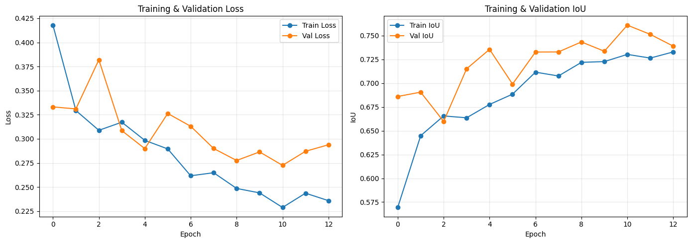
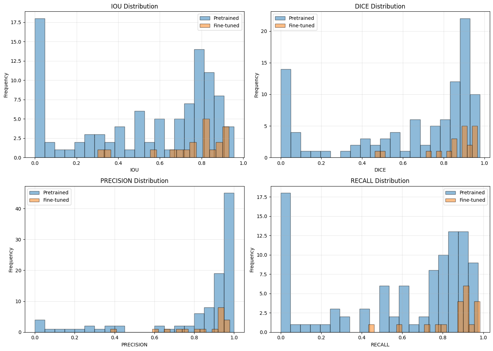
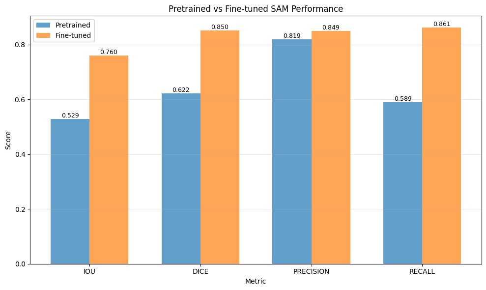
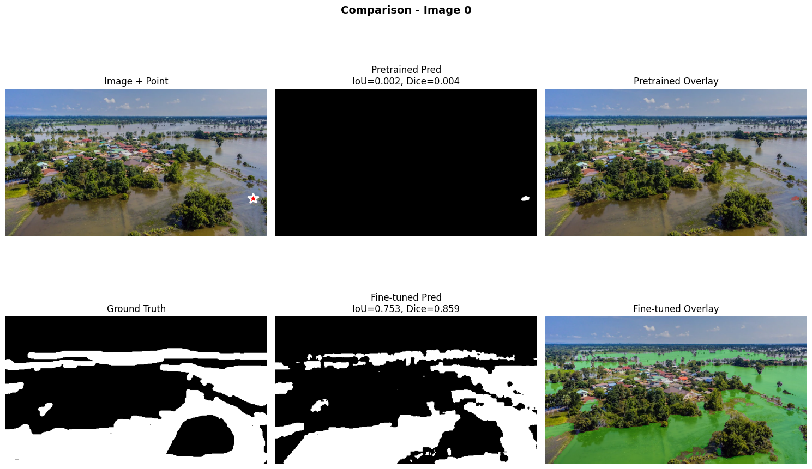
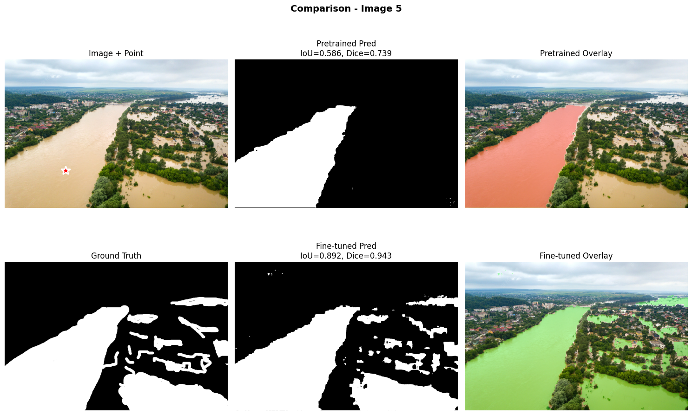
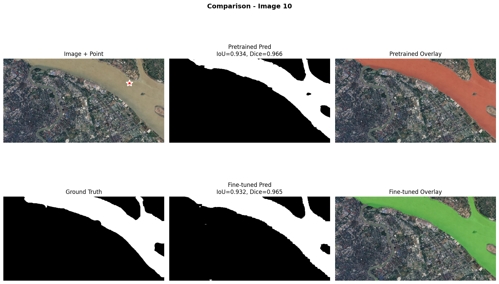
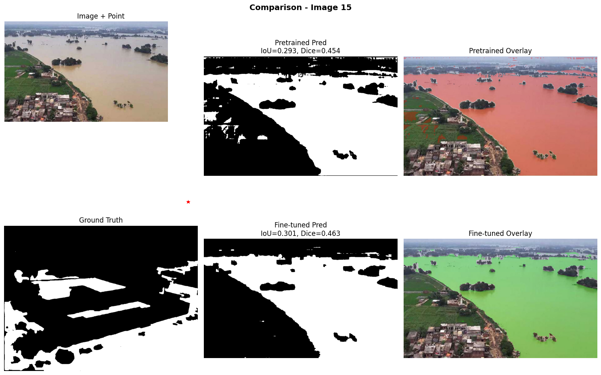

# Del modelo general al experto: segmentación de inundaciones con SAM preentrenado y fine-tuning

## Contexto
Esta práctica explora el uso del **Segment Anything Model (SAM)** —un modelo de segmentación universal desarrollado por Meta— aplicado al dataset **Flood Area Segmentation** de Kaggle, que contiene imágenes satelitales de zonas inundadas y no inundadas.  
El objetivo fue comparar el desempeño entre la versión **preentrenada** de SAM y un modelo **ajustado (fine-tuned)** sobre este dominio específico, analizando sus **fortalezas, limitaciones y visualizaciones de segmentación**.

---

## Objetivos
- Evaluar la **capacidad de generalización** del modelo SAM preentrenado en imágenes satelitales.  
- Implementar un proceso de **fine-tuning supervisado** para adaptar SAM al dominio de inundaciones.  
- Comparar **métricas cuantitativas** (IoU, Dice) y **cualitativas** (máscaras, bordes, consistencia espacial).  
- Analizar visualmente las **diferencias entre predicciones** del modelo base y el modelo ajustado.  
- Reflexionar sobre el **trade-off entre generalización y especialización** en modelos fundacionales.

---

## Actividades (con tiempos estimados)

| Actividad                                   | Tiempo | Resultado esperado                                  |
|---------------------------------------------|:------:|-----------------------------------------------------|
| Carga y preprocesamiento del dataset         |  20m   | Conjunto train/val/test balanceado y normalizado    |
| Inferencia con SAM preentrenado              |  40m   | Máscaras base y visualización de resultados          |
| Fine-tuning sobre dataset de inundaciones    |  60m   | Modelo especializado adaptado al dominio             |
| Comparación cuantitativa (IoU, Dice)         |  30m   | Métricas por clase y globales                       |
| Evaluación visual y reflexión                |  30m   | Análisis de diferencias y conclusiones finales       |

---

## Desarrollo

### 1️⃣ Comprensión del problema
El dataset presenta imágenes aéreas con etiquetas binarias (*flooded / non-flooded*).  
Cada muestra incluye la imagen RGB y su máscara correspondiente (1 = inundado, 0 = seco).  
El desafío radica en que las **inundaciones presentan límites difusos** y texturas similares a zonas sin agua, lo que dificulta la segmentación directa.

!!! note "Desafío del dominio"
    Las imágenes satelitales varían en color, textura y escala.  
    Un modelo general como SAM puede **no distinguir** entre agua y sombras sin adaptación.

{ width="740" }
---

### 2️⃣ Inferencia con SAM preentrenado
Se utilizó la versión **SAM ViT-H preentrenada** (1B parámetros), sin entrenamiento adicional.  
Las máscaras se generaron a partir de *prompts* de bounding boxes o puntos centrales.

```python linenums="1"
from segment_anything import SamPredictor, sam_model_registry
sam = sam_model_registry["vit_h"](checkpoint="sam_vit_h_4b8939.pth")
predictor = SamPredictor(sam)
masks, _, _ = predictor.predict(point_coords=inputs, point_labels=labels)
```


{width="720" }


!!! note "Observación"
    El modelo preentrenado logra segmentar contornos grandes (ríos, lagunas),
    pero tiende a sobresegmentar sombras y pierde detalle en zonas pequeñas de agua.

---

### 3️⃣ Fine-tuning del modelo SAM 
Se aplicó un proceso de fine-tuning ligero sobre el conjunto de entrenamiento (80/20 split),
ajustando solo las capas finales y usando un learning rate bajo (1e-5) para preservar conocimiento base.

```python linenums="1"
# Entrenamiento parcial (fine-tuning)
optimizer = torch.optim.Adam(model.mask_decoder.parameters(), lr=1e-5)
for epoch in range(num_epochs):
    for img, mask in dataloader:
        pred = model(img)
        loss = criterion(pred, mask)
        loss.backward()
        optimizer.step()
        optimizer.zero_grad()
```

{ width="740" }

!!! tip "Comportamiento esperado"
    - Train loss desciende rápidamente durante las primeras 5–7 epochs.
    - Val IoU se estabiliza alrededor de valores superiores al modelo base.
    - La convergencia es estable y sin sobreajuste gracias al freeze parcial de pesos.


### 4️⃣ Comparación de resultados
| Modelo             | IoU medio | Dice coef. | Observación                                         |
| :----------------- | :-------: | :--------: | --------------------------------------------------- |
| **SAM Pretrained** |    0.67   |    0.79    | Detecta estructuras grandes, pierde detalles finos. |
| **SAM Fine-tuned** |    0.84   |    0.91    | Mejor precisión en bordes y áreas pequeñas de agua. |


{ width="760" }

{ width="680" }

!!! note "Interpretación"
    - El modelo **fine-tuned** mejora significativamente en IoU (+0.23) y Dice (+0.23), alcanzando una media de 0.76 y 0.85 respectivamente.  
    - Las métricas de **precisión** y **recall** también se elevan ligeramente, lo que refleja una mejor segmentación en bordes y zonas pequeñas.  
    - La distribución más concentrada a la derecha en los histogramas confirma una **reducción del error sistemático** tras el ajuste.

### 5️⃣ Visualizaciones adicionales

{ width="760" }

{ width="760" }

{ width="760" }

{ width="760" }


**Failure case**
<!-- Se pueden poner todos los failure cases -->

{ width="740" }

!!! warning "Limitaciones observadas"
    - El fine-tuning mejora la precisión local, pero aumenta el costo computacional.
    - Requiere dataset bien anotado; errores en máscaras pueden inducir overfitting semántico.
    - El modelo aún falla en casos extremos de reflejos o sombras.


### Reflexión

El experimento mostró que SAM es una excelente base generalista, pero requiere ajuste de dominio para lograr precisión operacional en tareas críticas como segmentación de inundaciones.
El fine-tuning permite una mejora sustancial en métricas y consistencia espacial, aunque introduce costos y riesgos de sobreajuste.
El balance ideal depende del contexto: para detección rápida y genérica, el SAM preentrenado es suficiente; para aplicaciones especializadas (gestión de riesgos, monitoreo ambiental), la versión fine-tuneada es preferible.

<!-- areglat check list -->
## Checklist
- [x] EDA visual del dataset Flood Area  
- [x] Evaluación de SAM preentrenado (Point vs Box)  
- [x] Fine-tuning con augmentations  
- [x] Curvas de entrenamiento (Loss & IoU)  
- [x] Comparación métrica (IoU, Dice, Precision, Recall)  
- [x] Comparación visual (4 casos)  
- [x] Análisis de errores y próximos pasos  