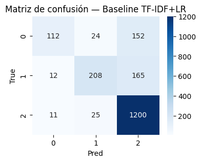

# Clasificación de Sentimiento en Tweets Financieros con Transformers

## 🧠 Contexto  
En este trabajo comparé dos enfoques para clasificar **sentimiento financiero** en tweets (Bearish, Bullish, Neutral):

- **Modelo clásico:** TF-IDF + Logistic Regression  
- **Modelo moderno:** Transformer preentrenado (FinBERT / BERT-base)

El objetivo fue evaluar qué tan bien cada enfoque maneja textos breves, ambiguos y ruidosos típicos de Twitter financiero.

---

## 🎯 Objetivos de aprendizaje

- Cargar y explorar datasets textuales con `datasets` y `pandas`.  
- Construir un **baseline clásico** (TF-IDF + LR).  
- Realizar **fine-tuning de un Transformer** para clasificación multiclase.  
- Evaluar métricas (accuracy, F1) y visualizar resultados.  
- Comparar ambos enfoques y redactar conclusiones fundamentadas.

---

## 🔍 Exploración del dataset

- Tweets muy cortos: **10–15 tokens** → poco riesgo de truncation.  
- Dataset **desbalanceado** (clase Neutral dominante).  
- N-grams por clase:
  - *Bearish (0):* `cuts`, `lower`, `misses`, `down`, `loss`.  
  - *Bullish (1):* `beats`, `up`, `profit`, `gain`.  
  - *Neutral (2):* lenguaje informativo sin carga emocional.

---

## 📊 Baseline: TF-IDF + Logistic Regression

### Matriz de confusión

Las diagonales muestran que el modelo acierta bien la clase Neutral, pero confunde bastante Bearish y Bullish:

{ width="360" }

```python
from sklearn.metrics import confusion_matrix, classification_report
import seaborn as sns
import matplotlib.pyplot as plt

y_pred = pipe.predict(X_test)
cm = confusion_matrix(y_test, y_pred)

plt.figure(figsize=(4, 3))
sns.heatmap(cm, annot=True, fmt="d", cmap="Blues")
plt.title("Matriz de confusión — Baseline TF-IDF+LR")
plt.xlabel("Pred"); plt.ylabel("True")
plt.show()

print(classification_report(y_test, y_pred))
```
### Métricas del baseline
```python
    accuracy  ≈ 0.80
    F1 macro ≈ 0.68

    precision    recall  f1-score   support

    0 (Bearish)   0.83      0.39      0.53       288
    1 (Bullish)   0.81      0.54      0.65       385
    2 (Neutral)   0.79      0.97      0.87      1236
```

**Lectura rápida**
- Muy buen desempeño en Neutral (2) gracias al desbalance.
- Mucho peor en Bearish (0) y Bullish (1) → el modelo BoW no capta bien el contexto ni matices.
---

## 🤖 Fine-tuning de Transformer (FinBERT/BERT)

Se probó primero `ProsusAI/finbert` y se hizo fallback a `bert-base-uncased` si no estaba disponible.

Ejemplo de tokenización BPE:
```python
    samples = [
        "Esto es inaceptable y ofensivo.",
        "Gran trabajo del equipo, ¡excelente!"
    ]
    for s in samples:
        print(tokenizer.tokenize(s))
```
Salida ejemplo:
```python
    ['est', '##o', 'es', 'ina', '##ce', '##pta', '##ble', 'y', 'of', '##ens', '##ivo', '.']
    ['gran', 'tr', '##aba', '##jo', 'del', 'e', '##qui', '##po', ',', '¡', 'excel', '##ente', '!']
```
## 📈 Curvas de validación del Transformer

El entrenamiento se hizo con:
- `learning_rate = 2e-5`
- `batch_size = 16`
- `num_train_epochs = 3`

{ width="360" }

```python
    hist = trainer.state.log_history
    acc = [x["eval_accuracy"] for x in hist if "eval_accuracy" in x]
    f1s = [x["eval_f1"] for x in hist if "eval_f1" in x]

    plt.plot(acc, label="Accuracy")
    plt.plot(f1s, label="F1")
    plt.title("Validación por época")
    plt.xlabel("Epoch")
    plt.ylabel("Score")
    plt.legend()
    plt.show()
```
**Métricas finales del Transformer**
```python
    Epoch 1 — loss=0.40 | acc=0.862 | F1=0.810
    Epoch 2 — loss=0.39 | acc=0.872 | F1=0.826
    Epoch 3 — loss=0.47 | acc=0.871 | F1=0.828
```
---
##  Comparación Baseline vs Transformer
```python
    from sklearn.metrics import accuracy_score, f1_score

    y_pred_base = pipe.predict(X_test)
    base_acc = accuracy_score(y_test, y_pred_base)
    base_f1  = f1_score(y_test, y_pred_base, average="macro")

    preds_logits = trainer.predict(tokenized["test"]).predictions
    y_pred_tr = preds_logits.argmax(axis=-1)
    tr_acc = accuracy_score(tokenized["test"]["labels"], y_pred_tr)
    tr_f1  = f1_score(tokenized["test"]["labels"], y_pred_tr, average="macro")

    print({
        "baseline":   {"acc": base_acc, "f1": base_f1},
        "transformer": {"acc": tr_acc, "f1": tr_f1},
    })
```

| Modelo                    | Accuracy | F1 Macro | Comentario principal                                      |
| ------------------------- | -------- | -------: | --------------------------------------------------------- |
| **TF-IDF + LR**           | 0.80     |     0.68 | Bueno en Neutral, débil en Bearish/Bullish.               |
| **Transformer (FinBERT)** | 0.87     |     0.83 | Mejora clara en clases minoritarias y matices semánticos. |


## Reflexión final
- El baseline BoW funciona como piso razonable, pero está muy limitado a patrones superficiales de palabras.
- El Transformer captura contexto y tono (por ejemplo, diferencia “up on profit beat” de “up despite weak outlook”), lo que se traduce en un F1 macro mucho mejor.
- El dataset desbalanceado obliga a mirar más allá de la accuracy y concentrarse en métricas balanceadas como F1 macro.
---
## Checklist
- [x] EDA (longitud, distribución de clases, n-grams, WordCloud).
- [x] Baseline TF-IDF + Logistic Regression entrenado y evaluado.
- [x] Fine-tuning de Transformer con Hugging Face Trainer.
- [x] Curvas de validación (Accuracy/F1) y matriz de confusión guardadas como imágenes.
- [x] Comparación cuantitativa y análisis cualitativo.
- [x] Reflexión sobre ventajas y límites de cada enfoque.